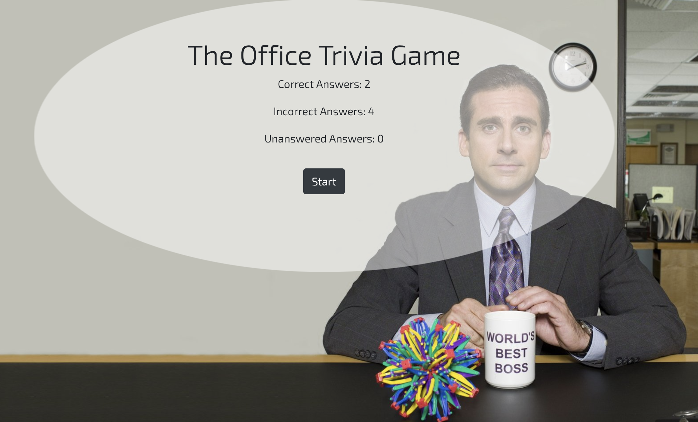

### The Office Themed Trivia Game

* This is a trivia game created to showcase my javascript, Jquery, and javascript timing events skills
  
* You have 15 seconds to attempt to correctly answer each trivia question 

* The game continues to the next question once 15 seconds have expired, or you have attempted to answer the question 

* At the end of the game, your score totals are displayed and you can restart the game if you choose

* Game Link: https://cmader555.github.io/TriviaGame/

## Installation 

* If you would like you can clone or download this code to your local machine

## Preview 

